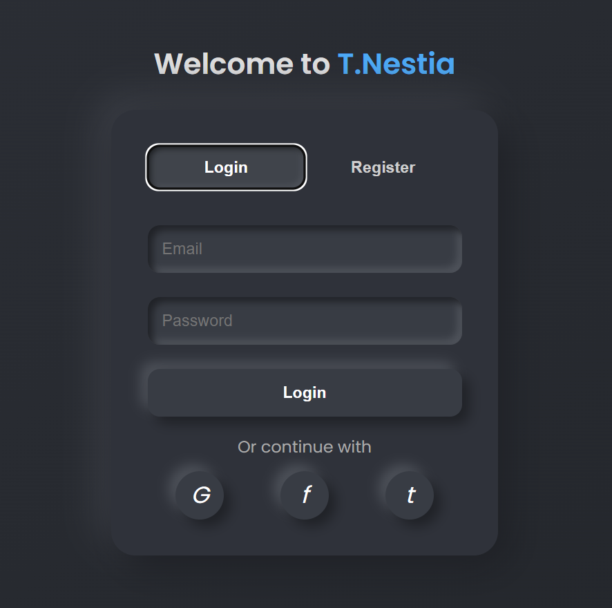
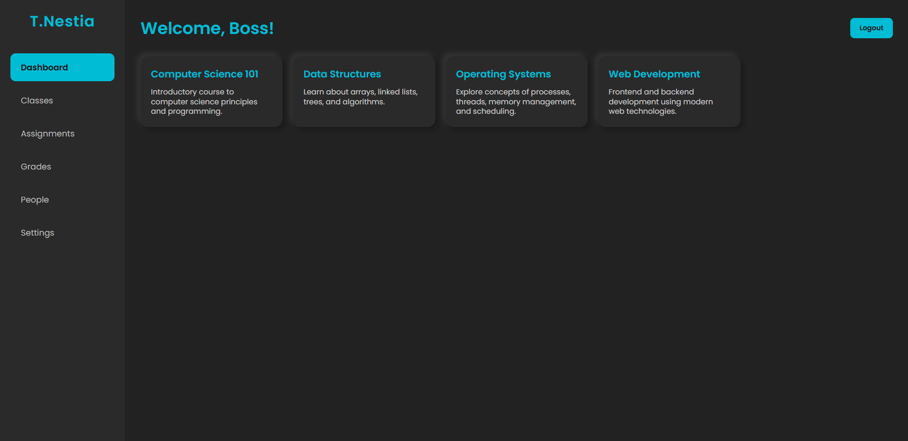

# T.Nestia Login & Dashboard UI

A modern and responsive Login/Register interface with a dashboard inspired by Google Classroom. Built using **HTML, CSS, and JavaScript**.

## 🔥 Features

- 👤 Login and Register tab system
- 🔒 Password validation with inline feedback
- 🧠 Dashboard with class cards
- 🎨 Dark-themed neumorphic design
- 💬 Inline password hints
- 🔁 Form toggle with smooth UX
- 💻 Responsive layout (desktop + mobile)

## 📸 Screenshots

### Login / Register Interface

### Dashboard (After Login)

